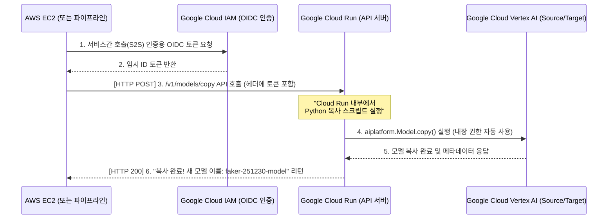

# Cloud Run을 활용한 모델 복사 아키텍처 가이드 (Serverless API)

AWS EC2(또는 외부 CI/CD, 온프레미스)에서 직접 Google Cloud SDK 인증을 거치는 방식(WIF, JSON 키)의 대안으로, **가장 아키텍처가 깔끔하고 의존성이 낮은 방법**입니다.

이 접근법은 복사 로직(`copy_model.py`)을 Google Cloud 내부의 **Cloud Run(서버리스 컨테이너)** 로 올려 API(REST 엔드포인트) 형태로 만들어 둡니다.
EC2는 단순히 이 API에 HTTP POST 요청을 보내는 것으로 복사 작업을 트리거합니다.

---

## 1. 아키텍처 구조 장점

1. **단순함의 극치**: EC2 내부에는 Python SDK, 거대한 의존성 패키지, 키 파일 관리가 일절 필요 없습니다. `curl`이나 Python의 `requests` 모듈 하나면 끝입니다.
2. **보안 위임**: Google Cloud 안에서 도는 Cloud Run은 자체 서비스 계정을 기본 탑재하고 있어 `gcloud auth` 설정이나 키 파일 없이도 알아서 Vertex AI 권한을 가집니다.
3. **재사용성**: EC2 뿐만 아니라 사내의 어느 서버, 워크플로우 툴(Airflow 등)에서도 해당 URL만 찌르면 모델이 복사되는 표준 공통 인프라(Microservice) 역할을 수행할 수 있습니다.

---

## 2. 시퀀스 다이어그램 (Cloud Run 흐름)



---

## 3. 구현 아이디어 (FastAPI 기반 샘플)

Cloud Run에 배포할 파이썬 API 서버의 핵심 코드입니다. (해당 코드를 Docker 이미지로 말아서 Cloud Run에 배포합니다.)

```python
# main.py (Cloud Run에 배포될 FastAPI 서버)
from fastapi import FastAPI, HTTPException
from google.cloud import aiplatform
import os

app = FastAPI(title="Vertex AI Model Copy API")

TARGET_PROJECT = os.environ.get("TARGET_PROJECT", "gemini-fine-tuning-target")
SOURCE_PROJECT = os.environ.get("SOURCE_PROJECT", "gemini-fine-tuning-source")
LOCATION = os.environ.get("LOCATION", "us-central1")

@app.post("/v1/models/copy")
def copy_model(source_model_id: str, destination_model_id: str):
    try:
        # Cloud Run 환경에서는 서비스 계정이 자동으로 물리기 때문에 환경변수나 키 설정이 필요 없습니다.
        aiplatform.init(project=TARGET_PROJECT, location=LOCATION)
        
        source_model_path = f"projects/{SOURCE_PROJECT}/locations/{LOCATION}/models/{source_model_id}"
        source_model_obj = aiplatform.Model(model_name=source_model_path)
        
        # 모델 복사 (동기식 대기 - 타임아웃 30분~60분 이내로 설정 필요)
        copied_model = source_model_obj.copy(
            destination_location=LOCATION,
            destination_model_id=destination_model_id
        )
        
        return {"status": "success", "resource_name": copied_model.resource_name}
    except Exception as e:
        raise HTTPException(status_code=500, detail=str(e))
```

---

## 4. EC2 (클라이언트) 측에서의 실행 방법

Cloud Run이 배포되면 주어지는 URL(예: `https://my-copy-api-xxxxx-uc.a.run.app`)을 향해 아래와 같이 단순 호출만 하면 됩니다.

### 파이썬 코드로 호출하기 (EC2 내부)
```python
import requests
import google.auth.transport.requests
import google.oauth2.id_token

API_URL = "https://my-copy-api-xxxxx-uc.a.run.app/v1/models/copy"
SOURCE_MODEL_ID = "7704127342733426688"
DEST_MODEL_ID = "target-model-260213"

# Google Cloud OIDC 토큰 발급 (서비스 계정 WIF나 키로 발급받음)
auth_req = google.auth.transport.requests.Request()
token = google.oauth2.id_token.fetch_id_token(auth_req, API_URL)

headers = {"Authorization": f"Bearer {token}"}
payload = {
    "source_model_id": SOURCE_MODEL_ID,
    "destination_model_id": DEST_MODEL_ID
}

print("Cloud Run으로 모델 복사를 지시합니다...")
response = requests.post(API_URL, headers=headers, params=payload)

if response.status_code == 200:
    print("✅ 성공:", response.json())
else:
    print("❌ 에러:", response.text)
```

## 5. 도입 시 고려사항 (Timeout)
Vertex AI 모델 복사는 딥러닝 가중치 복사로 인해 수 분에서 수십 분이 걸릴 수 있습니다.
Cloud Run은 기본적으로 HTTP 응답 제한 시간(Timeout)이 5분입니다. 배포 시 **이 제한 시간을 최대 60분으로 늘려주는 옵션(`--timeout=3600`)** 을 반드시 추가해야 복사 도중에 API가 끊어지지 않습니다.
