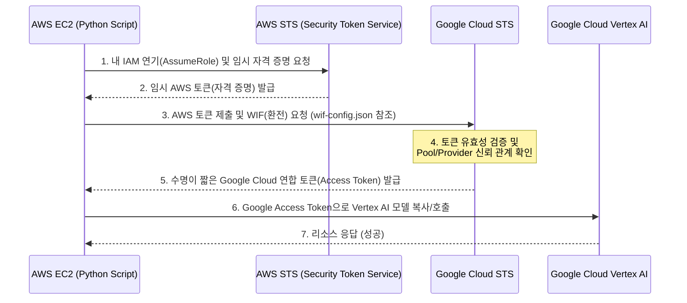

# AWS EC2 ↔ Google Cloud Workload Identity Federation 연동 가이드 (Best Practice)

AWS EC2와 같은 외부 클라우드 환경에서 Google Cloud 리소스(Vertex AI 등)를 접근할 때, 
가장 보안성이 높고 권장되는 **"키리스(Keyless)" 인증 방식**인 **Workload Identity Federation(WIF)** 구축 방법을 안내합니다.

이 방식을 사용하면 서비스 계정 키 파일(`.json`) 다운로드 및 누출 위험 없이, AWS IAM 역할을 통해 양 클라우드 간의 신뢰를 맺을 수 있습니다.

---

## 1. 개요 및 사전 준비

- **동작 원리**: AWS 인스턴스의 자격 증명(임시 토큰)을 Google Cloud에 제출하여 Google 측 서비스 계정으로 즉시 권한을 위임받습니다.

### 🏗️ Workload Identity Federation 아키텍처 흐름도



- **사전 요구사항**:
  - 두 클라우드 모두 최소 한 번씩 CLI(`aws`, `gcloud`)나 Console에서 관리자 권한을 가질 것
  - Google Cloud 프로젝트 ID
  - 접근 권한을 받을 Google Cloud 서비스 계정 (앞선 `service_account_guide.md`에서 생성한 것 사용 가능)
  - AWS EC2에 연결된 IAM Role (예: `ec2-gcp-ai-role`)

---

## 2. Google Cloud 측: Workload Identity Pool 및 Provider 생성

Google Cloud 내에서 AWS의 서명된 토큰을 받아들일 **신뢰 풀(Pool)** 및 **제공자(Provider)**를 선언합니다.

### 2-1) 풀(Pool) 생성
터미널에서 Google Cloud 접속 상태로 아래 명령어 실행
```bash
gcloud iam workload-identity-pools create "aws-ec2-pool" \
    --project="TARGET_PROJECT_ID" \
    --location="global" \
    --display-name="AWS EC2 WIF Pool"
```

### 2-2) AWS 계정을 제공자(Provider)로 등록
자신의 AWS Account ID(12자리 숫자, 예: `123456789012`)를 구글에 등록합니다.
```bash
gcloud iam workload-identity-pools providers create-aws "aws-provider" \
    --project="TARGET_PROJECT_ID" \
    --location="global" \
    --workload-identity-pool="aws-ec2-pool" \
    --account-id="123456789012"
```

---

## 3. Google Cloud 다리 놓기: IAM 정책 바인딩

이제 AWS EC2의 IAM 역할(Role)이 들어왔을 때, 구글 클라우드 특정 **서비스 계정**을 연기(Impersonate)할 수 있도록 권한을 매핑합니다.

### 3-1) 서비스 계정 권한 바인딩
AWS IAM Role ARN (예: `arn:aws:iam::123456789012:role/ec2-gcp-ai-role`)에서 요청이 올 때, Google 서비스 계정 권한을 승인해주는 필수 작업입니다.

```bash
gcloud iam service-accounts add-iam-policy-binding "your-sa@TARGET_PROJECT_ID.iam.gserviceaccount.com" \
    --project="TARGET_PROJECT_ID" \
    --role="roles/iam.workloadIdentityUser" \
    --member="principalSet://iam.googleapis.com/projects/PROJECT_NUMBER/locations/global/workloadIdentityPools/aws-ec2-pool/attribute.aws_role/arn:aws:iam::123456789012:role/ec2-gcp-ai-role"
```
*(참고: `PROJECT_NUMBER`는 구글 클라우드의 고유 숫자 형태 프로젝트 넘버입니다.)*

---

## 4. 환경 연결하기: 자격 증명 구성 파일 발급

Google Cloud 측에서 AWS EC2가 어떤 Pool, Provider, 서비스계정을 써서 요청해야 하는지를 안내해주는 **작은 맵핑 파일(Credential Configuration)**을 생성합니다.
*이 파일엔 실제 비밀키가 1도 들어있지 않아서 깃허브에 풀려도 무방합니다.*

```bash
gcloud iam workload-identity-pools create-cred-config \
    projects/PROJECT_NUMBER/locations/global/workloadIdentityPools/aws-ec2-pool/providers/aws-provider \
    --service-account="your-sa@TARGET_PROJECT_ID.iam.gserviceaccount.com" \
    --aws \
    --output-file="wif-config.json"
```

위에서 생성된 껍데기 설정 파일인 `wif-config.json`을 AWS EC2 서버로 옮깁니다.

---

## 5. 최종: AWS EC2에서 Google Cloud 호출 테스트

1. EC2 터미널에 접속합니다.
2. 해당 EC2 인스턴스는 반드시 앞서 등록했던 AWS IAM Role(`ec2-gcp-ai-role`)이 연결되어 있어야 합니다. (EC2 인스턴스 우클릭 메뉴를 통해 수정 가능)
3. 껍데기 설정 파일을 연동합니다. 환경변수로 Google SDK에게 WIF의 존재를 알립니다.
```bash
export GOOGLE_APPLICATION_CREDENTIALS="/home/ec2-user/wif-config.json"
```
4. 파이썬 스크립트 실행 (끝)
```bash
python3 copy_model.py
```

EC2 서버 내의 코드는 이제 비밀키(JSON) 없이 자체 AWS 토큰 증명만으로 구글 클라우드의 Vertex AI 모델을 완벽하게 다룰 수 있습니다.
